# Sindh Online School 📚

A free, bilingual (English/Sindhi) education platform bringing structured video learning to students across Sindh — organized as Class → Subject → Chapter → Topic, built as a Flutter mobile app with a Next.js admin panel sharing a common Firebase backend.

> This is a **showcase repository** presenting screenshots and a project overview. Full source code is kept private.

---

## 📖 About

Access to structured, curriculum-aligned educational content is limited for many students in Sindh, especially outside major cities. Sindh Online School organizes existing educational video content into a clear, navigable hierarchy — by class, subject, chapter, and topic — making it easy for students to find exactly the lesson they need, in either English or Sindhi.

The platform has three parts:
- A **Flutter mobile app** for students
- A **Next.js admin panel** for managing content
- A **shared Firebase backend** powering both

---

## ✨ Key Features

- **Structured Learning Hierarchy** — Content organized as Class → Subject → Chapter → Topic for easy navigation
- **Bilingual Support** — Full English and Sindhi language support throughout the app
- **Video-Based Lessons** — Curated YouTube lecture integration per topic
- **Admin Content Management** — Dedicated admin panel to manage classes, subjects, chapters, and topics
- **Modern Admin UI** — Glass morphism design system for a clean, modern management experience
- **Public Web Presence** — Informational website introducing the platform to students, parents, and educators
- **Free Access** — No cost to students, designed for broad accessibility

---

## 🛠️ Tech Stack

- **Mobile App:** Flutter
- **Admin Panel:** Next.js
- **Backend:** Firebase (Firestore, shared across mobile + admin)
- **Design System:** Glass morphism UI (admin panel)

---

## 🖥️ Screenshots

### 📱 Mobile App

  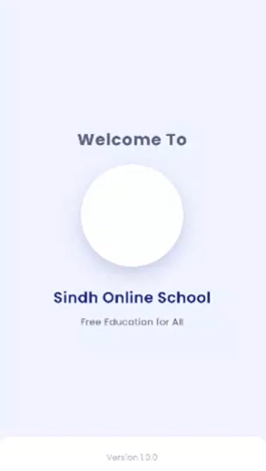
  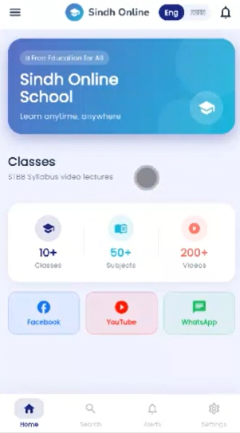
  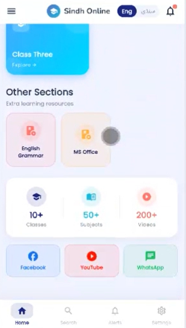
  

  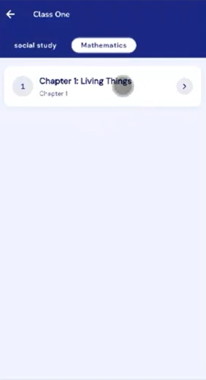
  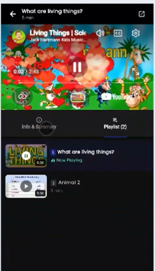
  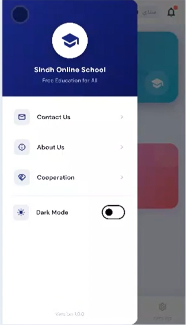
  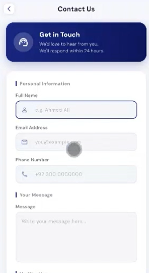

  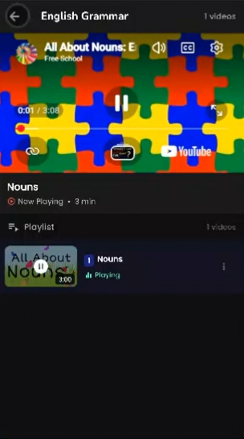
  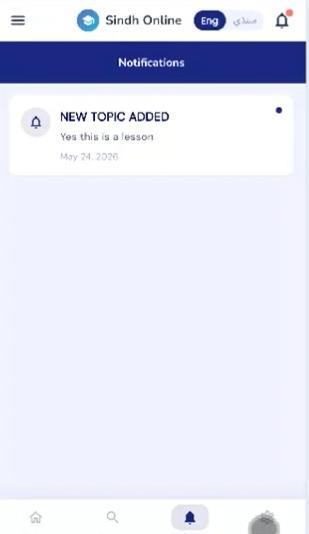
  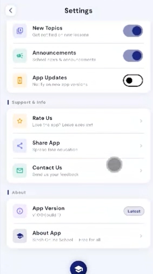
  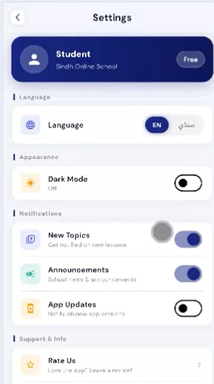
  

### 🖥️ Admin Panel

  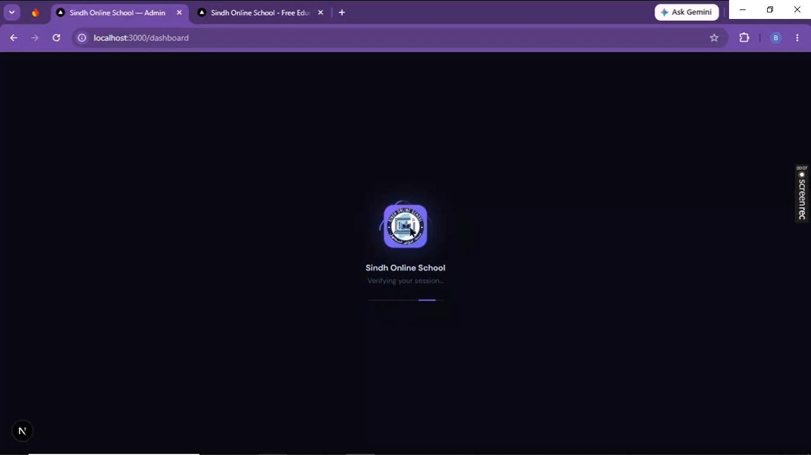
  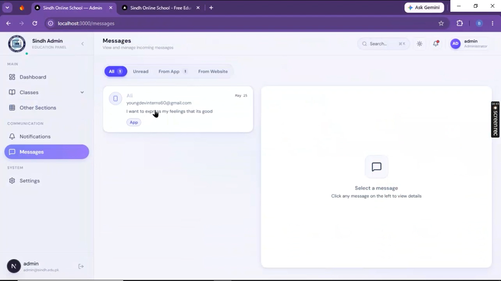
  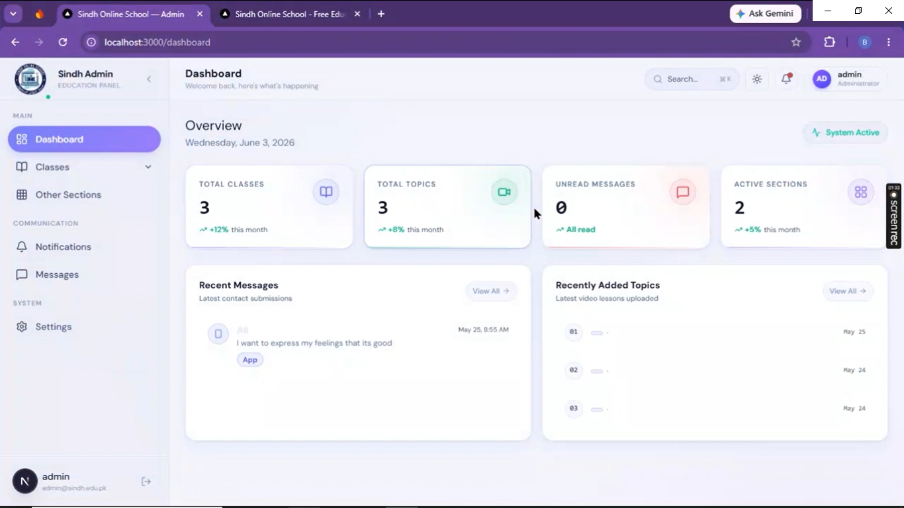
  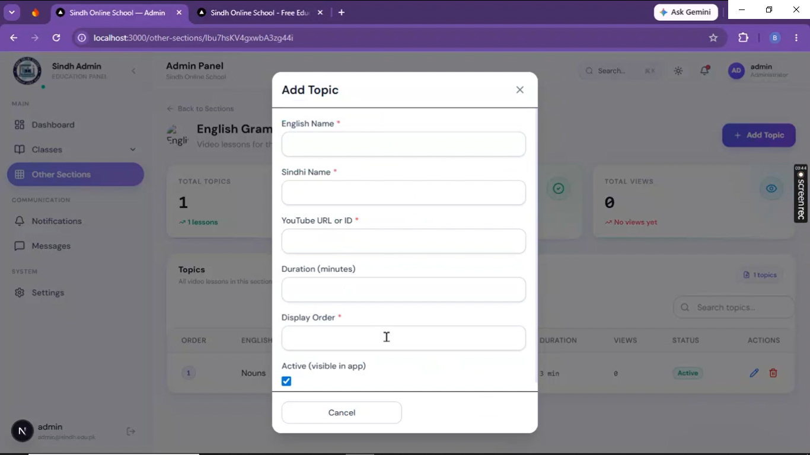
  

  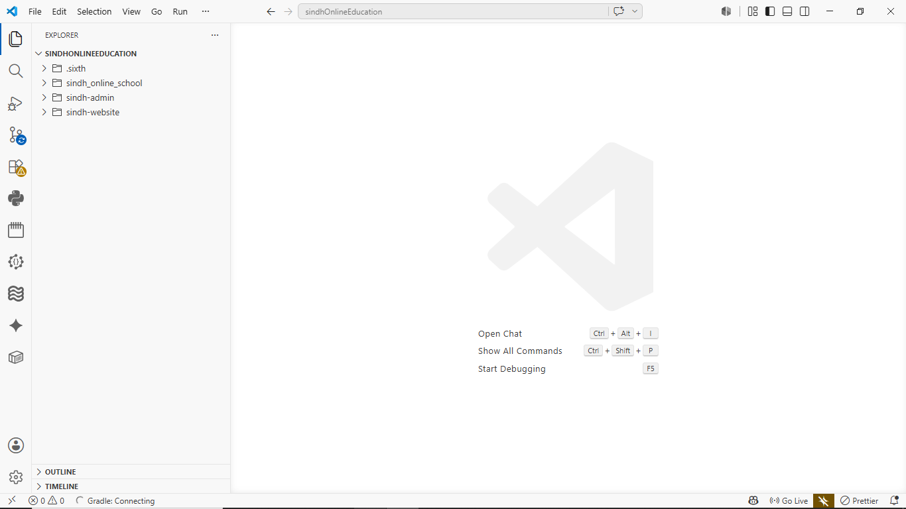
  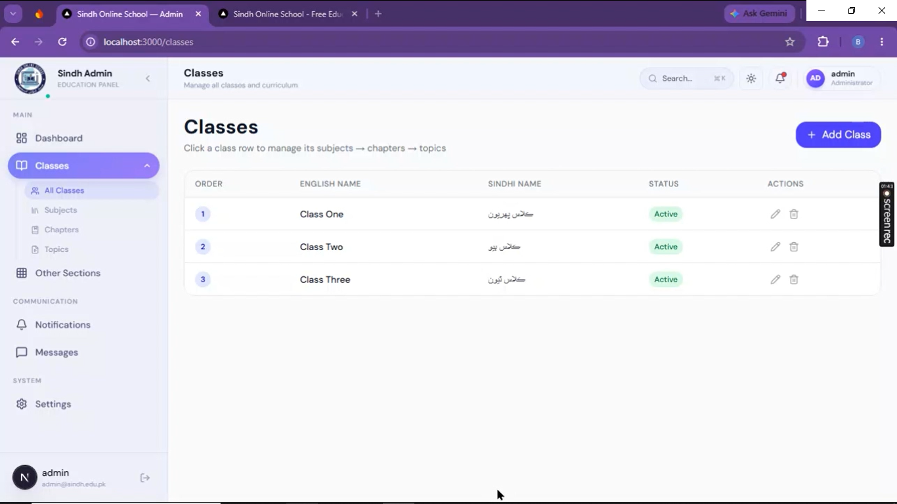
  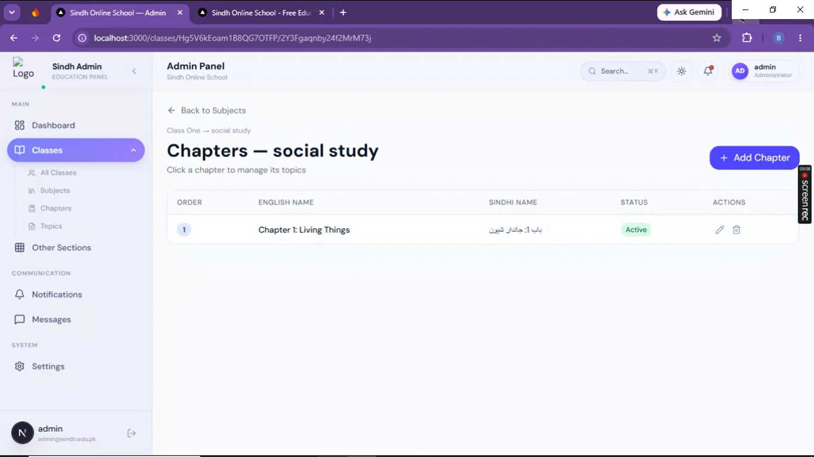
  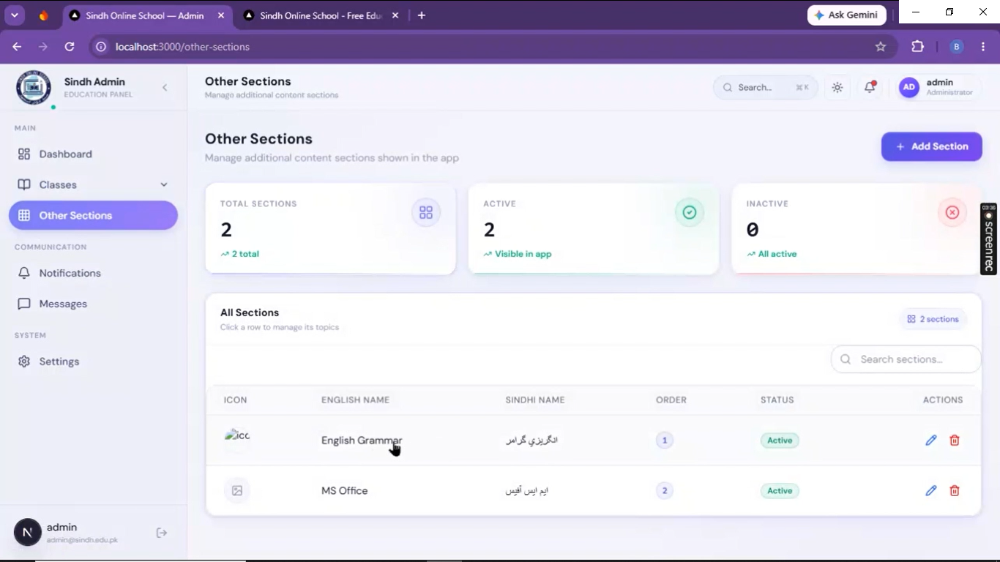
  

### 🌐 Public Website

  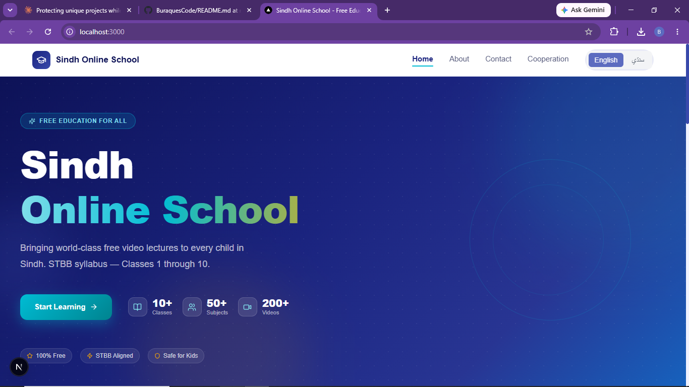
  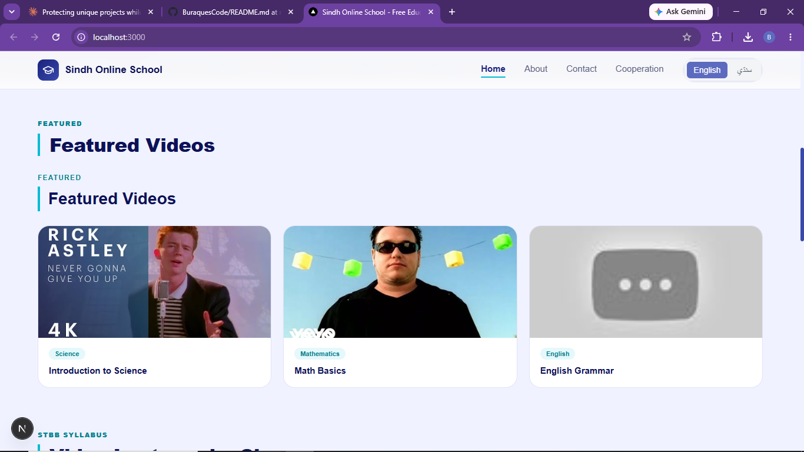
  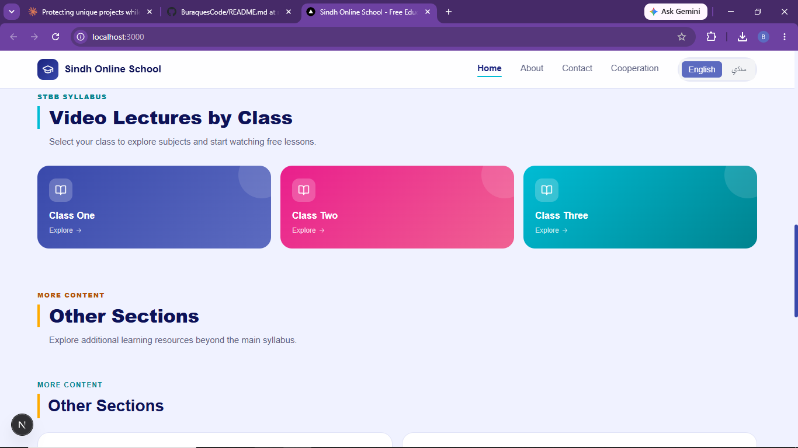

  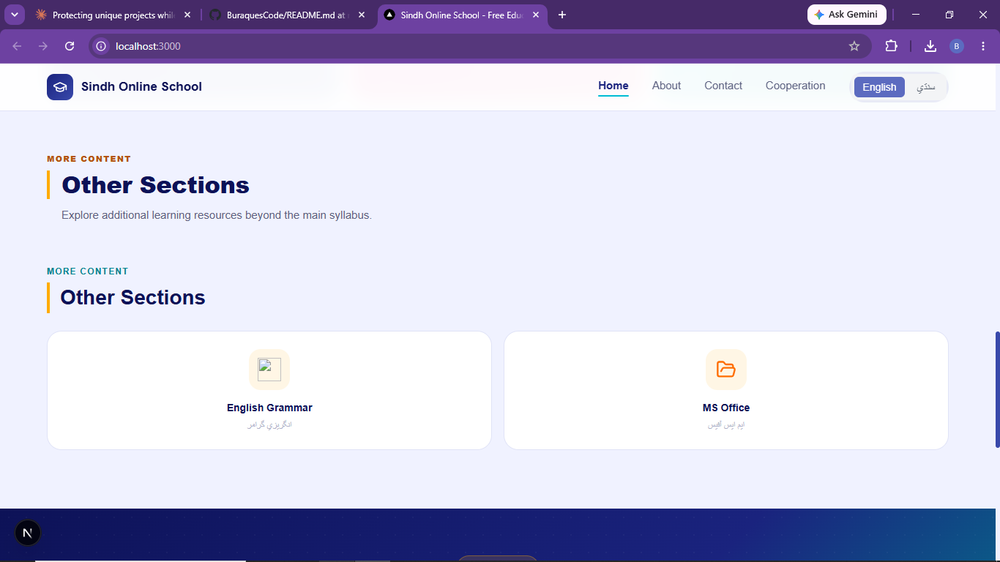
  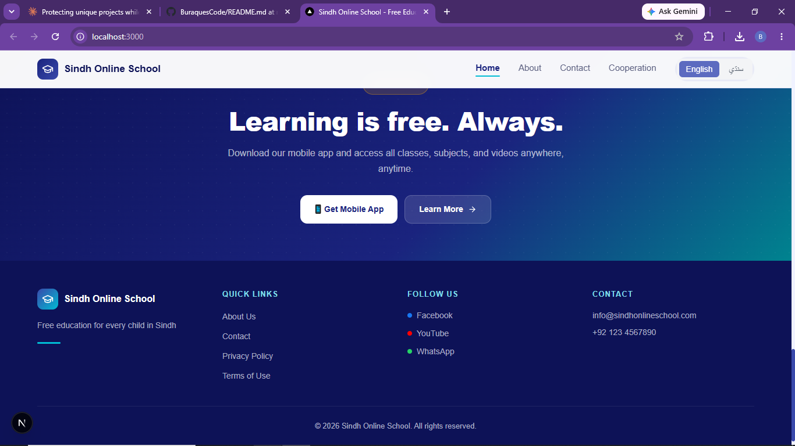

---

## 👤 Developer

Built by **Buraque** — Founder, CEO @ Youngdev Interns.
Full profile: [github.com/Buraquescode](https://github.com/Buraquescode)
